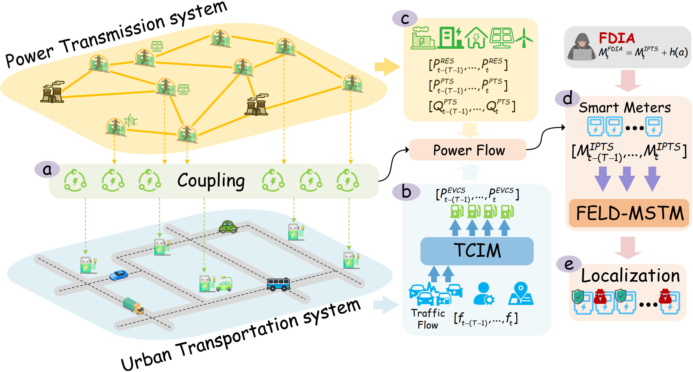
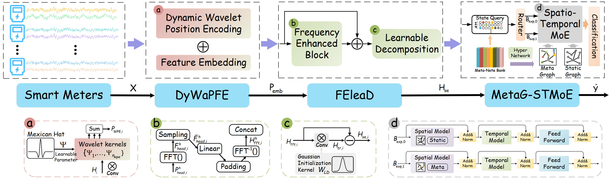

# FELD-MSTM: Robust False Data Injection Attacks Localization in Large-scale Integrated Power-Transportation Coupled Systems

## Abstract

Localizing false data injection attacks (FDIA) is essential for maintaining the integrity and security of modern power systems. The integration of renewable energy sources (RES) and electric vehicle charging stations (EVCS) \textcolor{red}{introduces benign fluctuations in measurements that can overlap with FDIA-induced perturbations, thereby complicating localization. Existing methods exhibit limited adaptability to the resulting spatio-temporal heterogeneity and lack reliable mechanisms to identify FDIA patterns. To address these challenges, we propose the frequency enhanced learnable decomposition with meta-guided spatio-temporal mixtures of experts (FELD-MSTM). It integrates frequency enhanced decomposition architecture to extract dynamic stationary trend and retain informative temporal component, and incorporates meta-guided spatio-temporal mixture of experts that leverages query-memory mechanism to capture context-sensitive spatio-temporal dependencies, thereby enabling discrimination between malicious anomalies and benign fluctuations. A large-scale integrated power-transportation coupled system is constructed based on a multi-source information fusion framework and a traffic-to-charge integration model, which provides hourly power injection measurements that jointly reflect the spatio-temporal evolution of conventional load, RES generation, and EVCS demand inferred from traffic flows. Extensive evaluations demonstrate that FELD-MSTM achieves improvements of at least 2.1\% in F1-score, 0.02 in MCC, and 0.13\% in FPR reduction, and also validate its robustness. 

## System Overview

## System Overview

## Requirements

Model is compatible with PyTorch==1.13 versions.

## Dataset

The multi-source data for the IPTS construction are derived from publicly accessible resources include: 

ACTIVSg2000 synthetic power system: https://electricgrids.engr.tamu.edu/; 

FHWA traffic flow data: https://www.fhwa.dot.gov/policyinformation/tmguide/; 

NREL renewable generation datasets: https://www.nrel.gov/grid/; 

U.S. EVCS location data: https://afdc.energy.gov/fuels/electricity_locations.html.

## Updates will be pushed progressively.......

